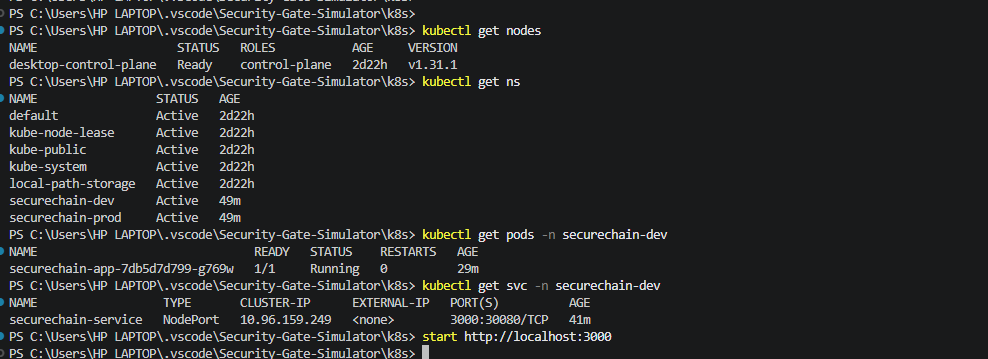
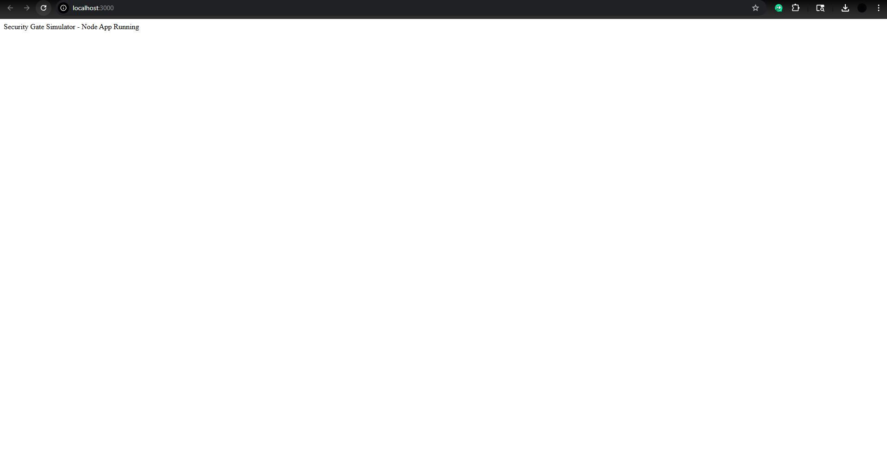

# Security Gate Simulator - Test Results

## TEST-007: Document All Test Cases with Screenshots

## Environment

- Windows 11
- Docker Desktop Kubernetes
- Local Node.js Application
- Namespace: securechain-dev

---

## Kubernetes Validation

The following checks were completed successfully:

- kubectl get nodes
- kubectl get namespaces
- kubectl get pods -n securechain-dev
- kubectl get svc -n securechain-dev

### Result

- Cluster node status Ready
- Namespaces created
- Pod running (1/1)
- Service exposed on NodePort

### Screenshot

---

## Application Validation

Application was accessed successfully through:

http://localhost:3000

### Result

Security Gate Simulator - Node App Running

### Screenshot

---

## Summary

Kubernetes deployment completed successfully. Application is running and accessible. Person 2 Kubernetes responsibilities completed successfully.