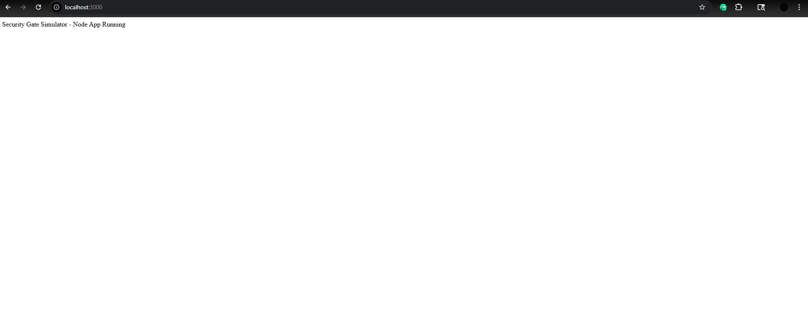
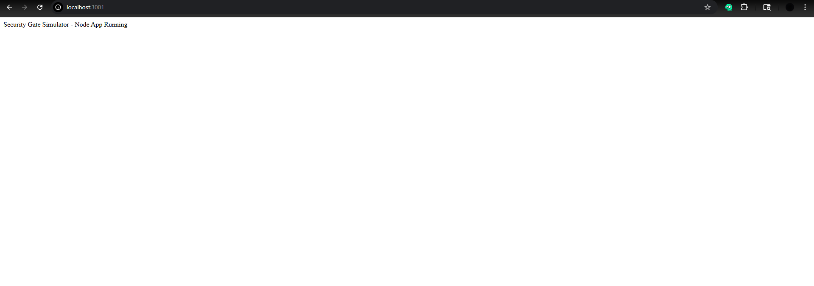
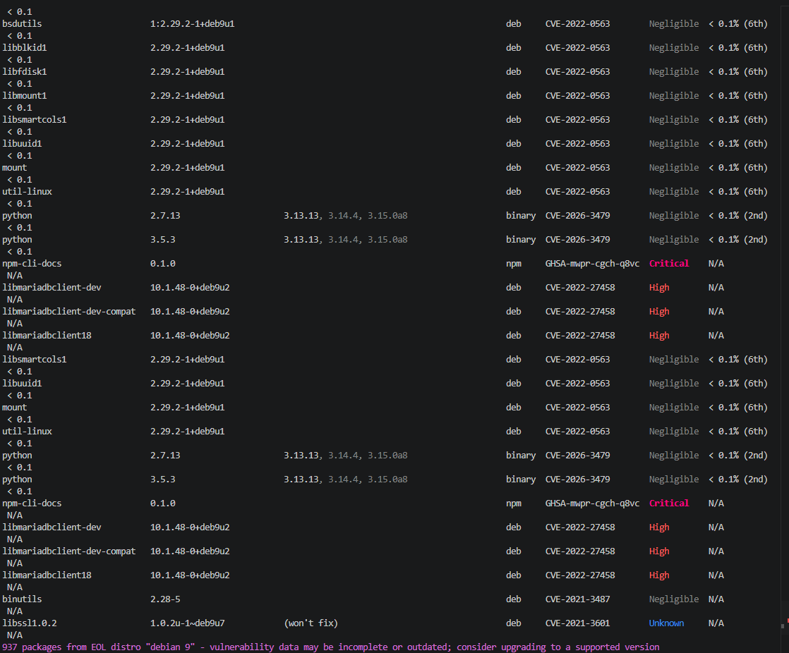
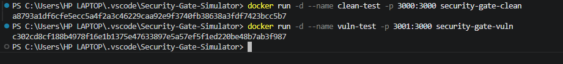

# Security Gate Simulator - Test Results

## Overview

This document summarizes the completed validation for the Security Gate Simulator project, including Docker image testing, vulnerability scanning, Kubernetes deployment, and pending CI/CD security gates.

---

## Test 1: Clean Image

Image: `security-gate-clean:latest`  
Port: `localhost:3000`

### Result

- Application runs successfully
- Container starts without errors
- Uses updated Node.js base image

### Screenshot

---

## Test 2: Vulnerable Image

Image: `security-gate-vuln:latest`  
Port: `localhost:3001`

### Result

- Application runs successfully
- Uses outdated Node.js base image
- Intended to simulate a vulnerable container

### Screenshot

---

## Test 3: Vulnerability Scan

Tool: Grype

### Result

- Vulnerabilities detected in the vulnerable image
- High and critical vulnerabilities found
- Outdated OS/packages increased security risk

### Screenshot

---

## Test 4: Docker Images Built

### Result

- Clean and vulnerable images were built successfully
- Vulnerable image is larger due to outdated dependencies

### Screenshot

---

## Test 5: Kubernetes Validation

The following Kubernetes checks were completed:

- `kubectl get nodes`
- `kubectl get namespaces`
- `kubectl get pods -n securechain-dev`
- `kubectl get svc -n securechain-dev`

### Result

- Cluster node status Ready
- Namespaces created
- Pod running 1/1
- Service exposed on NodePort

### Screenshot

---

## Test 6: Application Running in Kubernetes

URL: `http://localhost:3000`

### Result

Security Gate Simulator - Node App Running

### Screenshot

---

## Pending Dependent Test Cases

The following tests are prepared but pending final Jenkins/Cosign integration:

- TEST-002: Pipeline blocks vulnerable image with critical CVEs
- TEST-003: Pipeline blocks unsigned image
- TEST-005: Missing/tampered SBOM test
- TEST-006: Pipeline blocks invalid or missing SBOM

---

## Conclusion

The project successfully demonstrates Docker image testing, vulnerability scanning, and Kubernetes deployment. The clean and vulnerable images are available for security gate validation, and the Kubernetes deployment environment is operational. Final automated blocking tests will be completed after Jenkins/Cosign integration.